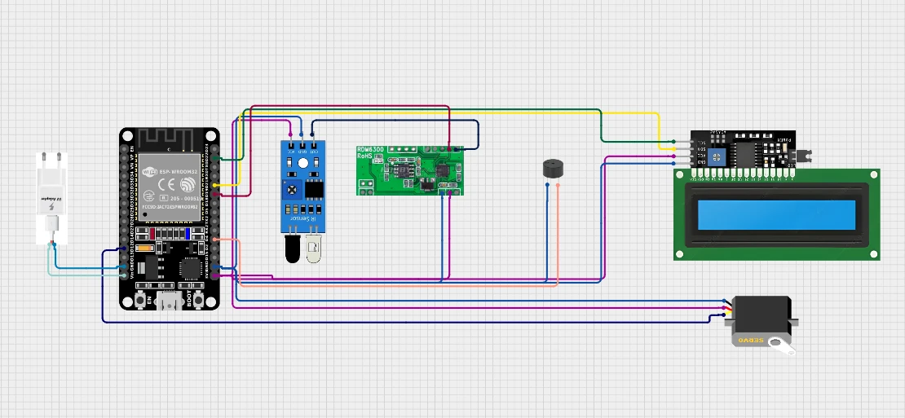
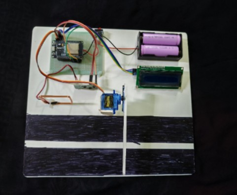

# Smart Toll Management System with Google Sheets Integration

An IoT-based toll management system using ESP32, RFID, servo motor, and an LCD display. This project automatically recognizes vehicles via RFID, manages toll payments, displays status, and logs transactions to a Google Sheet for cloud record keeping.

---

## Features

- **RFID Vehicle Detection:** Identify cars at the toll gate using RFID tags.
- **Automated Toll Deduction:** Deducts toll from balance and updates display.
- **Special Cases:**  
  - Lost car alerts
  - Emergency vehicle passage (no toll charged)
  - Low balance notification
- **Servo-Controlled Barrier:**  
  - Opens/closes automatically for valid transactions.
- **LCD Status Display:**  
  - Shows vehicle type, balance, alerts, and toll info.
- **Buzzer Alerts:**  
  - Audible feedback for important events.
- **Google Sheets Logging:**  
  - Each transaction/alert is logged remotely via Google Apps Script.

---

## System Overview

- **Microcontroller:** ESP32
- **RFID Reader:** RDM6300
- **Display:** 16x2 I2C LCD
- **Servo Motor:** For barrier control
- **Buzzer:** For audible alerts
- **WiFi:** ESP32 connects to local WiFi (SSID: `toll`, Password: `12121212`)
- **Power:** 5V adapter or battery pack

---

## Hardware Connections

_Image 2: Breadboard wiring diagram_

| Module          | Pin Connections (ESP32) |
|-----------------|------------------------|
| RDM6300 RFID    | RX → GPIO 19           |
| Servo Motor     | PWM → GPIO 12          |
| Buzzer          | VCC → GPIO 4           |
| LCD (I2C)       | SDA → D21, SCL → D22   |
| Power           | 5V, GND                |

---

## Physical Setup

_Image 3: Assembled hardware model_

---

## How It Works

1. **Initialization:**  
   LCD displays system status. ESP32 connects to WiFi.

2. **RFID Scan:**  
   - Place RFID tag near reader.
   - System reads card number, beeps, displays info.

3. **Card Logic:**  
   - Regular vehicle: Deducts toll, updates balance, opens barrier.
   - Low balance: Denies entry, displays warning, logs event.
   - Emergency vehicle: No toll, opens barrier, logs event.
   - Lost car: Sounds buzzer, sends alert, logs event.

4. **Cloud Logging:**  
   - Uses a Google Apps Script web endpoint to send transaction data (card number, toll amount, balance, status) to a Google Sheet.

---

## Setup Instructions

1. **Wire Hardware** as per diagram above.
2. **Update Card Numbers/Logic:**  
   - Edit `toll_google_sheet.ino` to set your own RFID card numbers, balances, and status logic.
3. **Google Apps Script:**  
   - Deploy your own script and update `scriptURL`.
   - Example Apps Script should parse GET params and append to your Google Sheet.
4. **Flash ESP32:**  
   - Use Arduino IDE and install libraries:
     - ESP32Servo
     - LiquidCrystal_I2C
     - rdm6300
     - WiFi
     - HTTPClient
5. **Power Up:**  
   - Connect 5V supply or batteries.
   - System boots and is ready for operation.

---

## Card Number Mapping (Default)

| Card Number | Vehicle Type      | Action                |
|-------------|-------------------|-----------------------|
| 4873937     | Low Balance       | Deny, log event       |
| 4885098     | Lost Car          | Alert, log event      |
| 4895189     | Emergency Vehicle | Free passage, log     |
| 6144429     | Regular Vehicle   | Deduct toll, log      |

_Edit mappings in code as needed._

---

## Google Sheets Integration

- Transactions are sent via HTTP GET to a Google Apps Script.
- Data fields: `card`, `toll`, `balance`, `status`.
- Script logs data in your Google Sheet for later review.

---

## Screenshots

### Schematic

### Physical Model

---

## License

MIT License

---

## Credits

Developed by [nahidislam106](https://github.com/nahidislam106)  
Hardware and code design by project author  
Images © Project Owner

---
